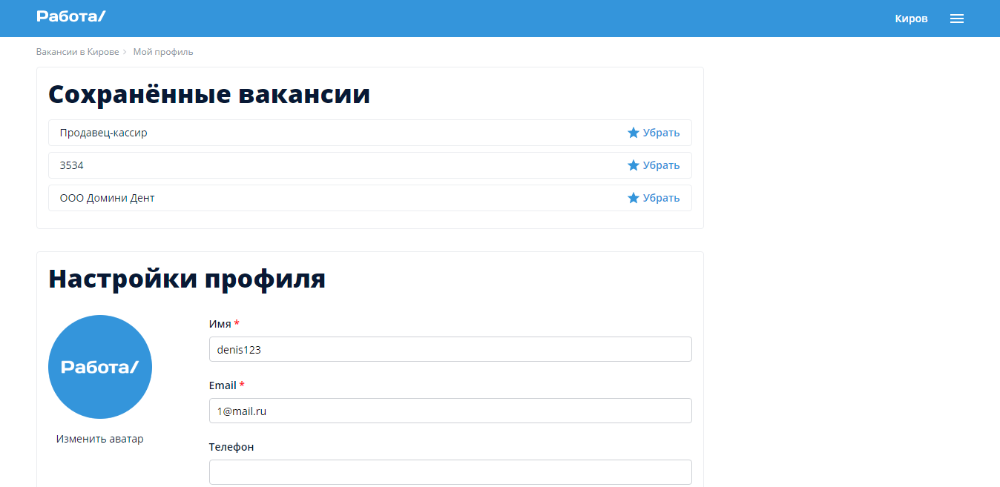

# Project for search job Frontend

Project for search job using MERN stack.
This is the frontend repo built with React.

Global state management is taken care of by React Context API. For avatar uploads uses Cloudinary.

## Running Locally

Then run <code>npm i && npm run start</code> to see the instaclone in action

## UI

### Аuthorization

### Home

### Detail

### Pofile

### Add job

